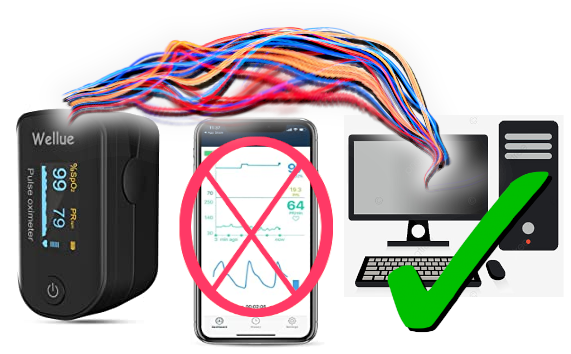
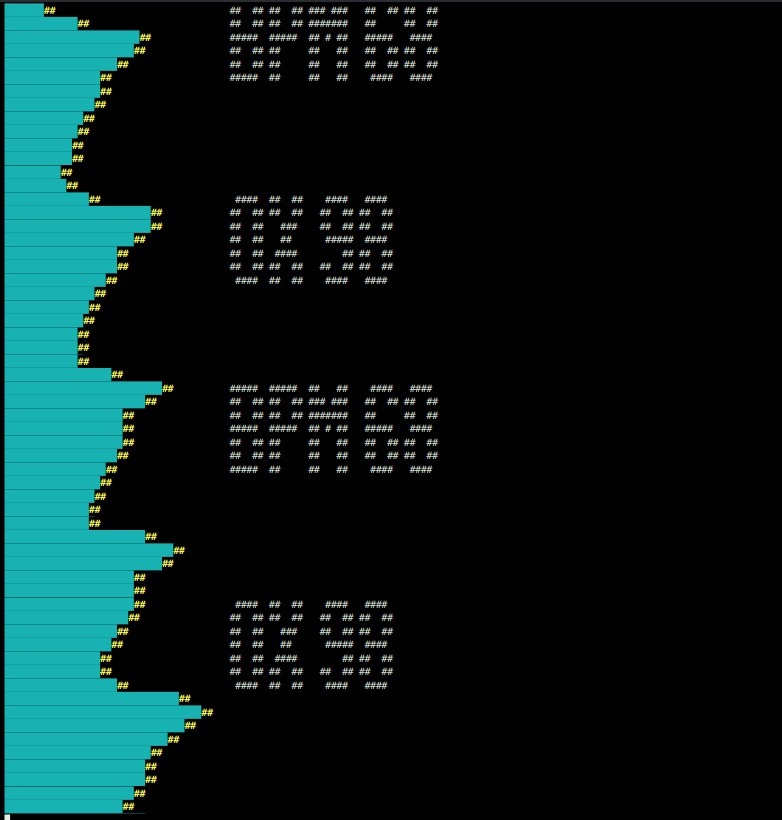
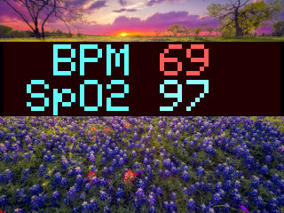

## Monitor a Bluetooth PulseOx's Data from PC (Python code)

Currently this possibly only runs in Linux, as its main
dependency, '[bluepy](https://github.com/IanHarvey/bluepy)', seems to be Linux-only.
(bluepy is for Bluetooth LE (low-energy devices)).

## Screenshots

Default text output (with the alert ranges set low to force it).

(Ignore the ALSA error. It's because I'm using "pysine" to play
an audio alert when the BPM or SpO2 are out of range, and
apparently there's some issue arising from the portaudio
sound library -> pyaudio -> pysine. I've experienced
it in multiple project playing audio.)

It's unlikely you have this LCD project set up. It's a separate
ESP8266 WiFi project I use for notices in our livingroom, and
this project can display the BPM/SpO2 on it. *The nature image
is I displayed on our own LCD. The project doesn't do that --
it displays the console-text and can connect to that WiFi
LCD project to display the BPM+SpO2 values in this image.*

[https://github.com/jaggzh/esp8266-wifi-lcd-touch](https://github.com/jaggzh/esp8266-wifi-lcd-touch)

## Usage

1. Copy settings-sample.py to settings.py and edit
1. Copy usercallbacks-example.py to usercallbacks.py, and then ignore it for now. (I use it to display a heart image on my LCD below the heart rate.)
1. Get a compatible pulseox. It's programmed, currently, to support the data coming from a **"Wellue Fingertip Pulse Oximeter, Blood Oxygen Saturation Monitor with Batteries for Wellness Use Bluetooth, Black"** [https://www.amazon.com/gp/product/B087Q724QM/](https://www.amazon.com/gp/product/B087Q724QM/).  (I have no relation to them.)
1. Set MAC address to the pulseox (see settings file)
1. `pip install bluepy pysine`
1. Run ./pulseox-bluetooth.py

## Dependencies

1. Python module: `bluepy` (required!)
1. Python module: `pysine` (used for audio alert tones, can remove in code)
