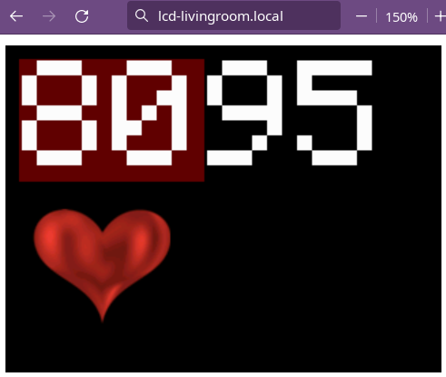

## Monitor a Bluetooth PulseOx's Data from PC (Python code)




Optionally, the python script can do something like I'm doing &ndash;
displaying on an LCD display instead of the computer.

* Currently this possibly only runs in Linux, as its main
dependency, '[bluepy](https://github.com/IanHarvey/bluepy)', seems to be Linux-only.
(bluepy is for Bluetooth LE (low-energy devices)).
* The current Bluetooth pulseox I'm using is: **"Wellue Fingertip Pulse Oximeter, Blood Oxygen Saturation Monitor with Batteries for Wellness Use Bluetooth, Black"** [https://www.amazon.com/gp/product/B087Q724QM/](https://www.amazon.com/gp/product/B087Q724QM/) Model: **FS20F**.  (I have no relation to them.)  The data is likely different for others so the handling of it must be customized if you get a different version.  ***Feel free to contact me for help.***

```
*Label on battery cover*
Pulse Oximeter Wellue(R)
Model: FS20F         Viatom(R)
Battery: 2x1.5V(AAA)
   Hunan Accurate Bio-Medical
   Technology Co, Ltd.
... address ...
```

## Screenshots

Default text output (with the alert ranges set low to force it).


It's unlikely you have this LCD project set up. It's a separate
ESP8266 WiFi project I use for notices in our livingroom, and
this project can display the BPM/SpO2 on it. *The nature image
is I displayed on our own LCD. The project doesn't do that --
it displays the console-text and can connect to that WiFi
LCD project to display the BPM+SpO2 values in this image.*


[https://github.com/jaggzh/esp8266-wifi-lcd-touch](https://github.com/jaggzh/esp8266-wifi-lcd-touch)

## Usage

1. Copy settings-sample.py to settings.py and edit
1. Copy usercallbacks-example.py to usercallbacks.py, and then ignore it for now. (I use it to display a heart image on my LCD below the heart rate.)
1. Get a compatible pulseox. It's programmed, currently, to support the data coming from a **"Wellue Fingertip Pulse Oximeter, Blood Oxygen Saturation Monitor with Batteries for Wellness Use Bluetooth, Black"** [https://www.amazon.com/gp/product/B087Q724QM/](https://www.amazon.com/gp/product/B087Q724QM/).  (I have no relation to them.)
1. Set MAC address to the pulseox (see settings file)
1. `pip install bluepy pysine`
1. Run ./pulseox-bluetooth.py

## Dependencies

1. Python module: `bluepy` (required!)
1. Python module: `pysine` (used for audio alert tones, can remove in code)
